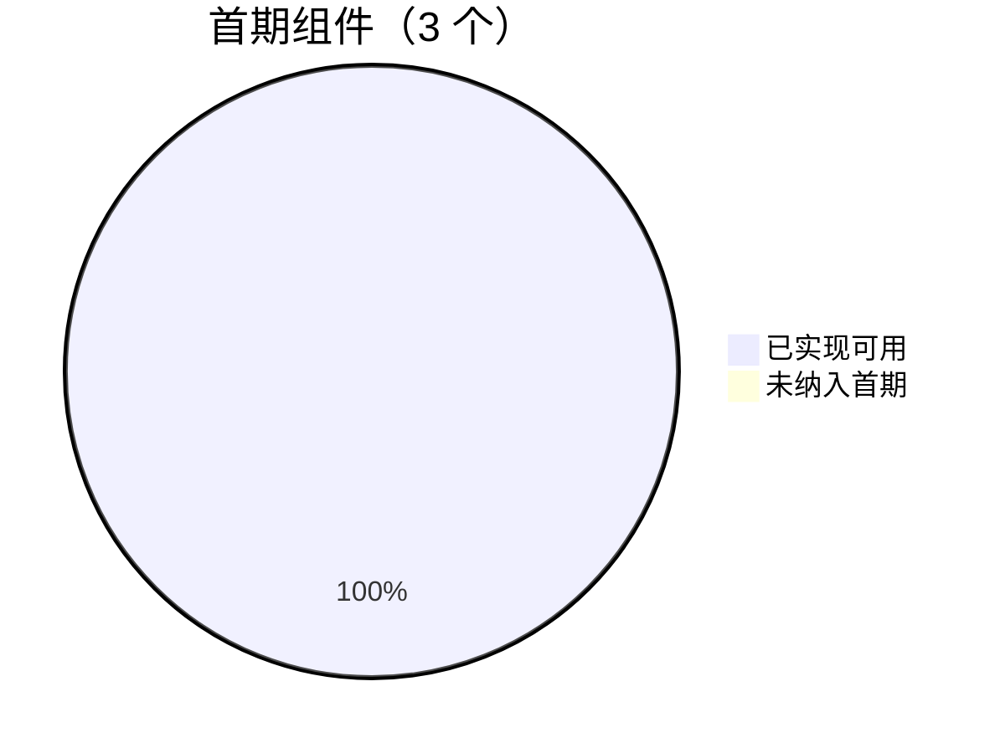

# components-pro-display 实现程度说明

> 最后更新：2026-06-05  
> 分支参考：`umd-build`

本文档记录 **Pro Display** 模块当前实现范围、完成度、已知限制与后续规划，便于评估能否用于 UMD / 纯 HTML 场景或 React 工程接入。

---

## 1. 目标与定位

| 项 | 说明 |
|----|------|
| **核心目标** | 提供与 `choerodon-ui/pro` **视觉一致**的 Button / Form / Table，**运行时零 DataSet / MobX 依赖** |
| **主要场景** | 纯 HTML + UMD 嵌入、轻量 React 页面、文档站展示 |
| **非目标** | 替代完整 Pro 数据驱动能力（编辑、校验、Lov、分页 DataSet 等） |

---

## 2. 总体完成度



| 维度 | 状态 | 说明 |
|------|------|------|
| 组件（Button / Form / Table） | ✅ 首期完成 | 可独立使用，样式复用 Pro Less |
| 专业搜索条 ProfessionalQueryBar | ✅ 完成 | 从 Pro Table 剥离，受控 props + 回调 |
| 运行时去 DataSet / MobX | ✅ 完成 | UMD 包仅 external React；无 observable |
| Gulp CJS/ES 编译 | ✅ 完成 | 输出 `pro-display/lib`、`pro-display/es` |
| UMD 独立构建 | ✅ 完成 | `npm run dist:pro-display` |
| Bisheng 文档站 | ✅ 完成 | 路由、菜单、3 组件 demo |
| Standalone HTML Demo | ✅ 完成 | `demo/standalone/*.html` |
| TextField / Select / Pagination / Icon | ✅ 完成 | 展示版 Field + 分页，无 DataSet |
| 查询表单样式（ProfessionalQueryBar） | ✅ 完成 | DOM 对齐 Pro + field less 进 UMD CSS |
| 单元测试 | ❌ 未做 | 无 `__tests__` |
| 独立 CSS（不引用 choerodon-ui Less） | ❌ 未做 | 样式仍 `@import` Pro/base Less |
| 真实 API 对接 Demo | ⚠️ 部分 | 有 curl 样例与 mock，HTML demo 未接真实接口 |

**综合评估：展示组件 + UMD + 查询条视觉对齐约 90% 完成；样式完全独立与 Field 全量为下一阶段。**

---

## 3. 组件实现明细

### 3.1 Button

| 能力 | Pro | pro-display | 备注 |
|------|-----|-------------|------|
| funcType（flat / raised / link） | ✅ | ✅ | |
| color 多色 | ✅ | ✅ | enum 与 Pro 对齐 |
| loading / Promise onClick | ✅ | ✅ | |
| icon + Progress | ✅ | ✅ | 使用本地 `primitives/Icon`、`Progress` |
| wait 节流/防抖 | ✅ | ✅ | lodash debounce |
| 中文双字间距 | ✅ | ✅ | |
| href 链接按钮 | ✅ | ✅ | |
| block / hidden / disabled | ✅ | ✅ | |
| tooltip（overflow 等） | ✅ | ⚠️ 部分 | 仅实现 `always`（title）；无 overflow 检测 |
| dataSet / name 表单联动 | ✅ | ❌ | 有意不支持 |
| Permission / Tooltip 组件集成 | ✅ | ❌ | 使用 `configureDisplay` + 简化 tooltip |

**文件：** `button/Button.tsx`、`button/enum.tsx`、`button/style/index.tsx`

---

### 3.2 Form

| 能力 | Pro | pro-display | 备注 |
|------|-----|-------------|------|
| Form + Form.Item 布局 | ✅ | ✅ | |
| labelLayout（horizontal / vertical / none / float / placeholder） | ✅ | ✅ | float/placeholder 仅透传子节点 |
| labelWidth / labelAlign / useColon | ✅ | ✅ | |
| required 星号展示 | ✅ | ✅ | 仅视觉，无校验 |
| header | ✅ | ✅ | |
| disabled（上下文） | ✅ | ✅ | aria-disabled |
| dataSet / record / fields | ✅ | ❌ | |
| 校验 / 提交 / 联动 | ✅ | ❌ | |
| columns 多列 table 栅格 | ✅ | ✅ | QueryBar `columns={queryFieldsLimit}` |
| 原生 input 自动包 Pro wrapper | ✅ | ✅ | `wrapNativeInput` |
| 内置 Field 控件 | ✅ | ⚠️ 部分 | 提供 TextField；Select 为展示版 |

**文件：** `form/Form.tsx`、`form/Item.tsx`、`form/FormContext.tsx`、`form/utils.ts`、`form/wrapNativeInput.tsx`

---

### 3.3 Table

| 能力 | Pro | pro-display | 备注 |
|------|-----|-------------|------|
| columns + dataSource 只读表格 | ✅ | ✅ | 原生 `<table>` 实现 |
| rowKey / render / align / width | ✅ | ✅ | 支持 `dataIndex` 点路径 |
| bordered / loading / title / emptyText | ✅ | ✅ | loading 用 `primitives/Spin` |
| queryBar = professionalBar | ✅ | ✅ | |
| queryFields + 更多折叠 | ✅ | ✅ | |
| buttons 工具栏 + summaryBar | ✅ | ✅ | `TableButtons` |
| onQuery / onReset / onBeforeQuery | ✅ | ✅ | 纯回调，无 DataSet query |
| 自定义 queryBar 节点 | ✅ | ✅ | |
| Table.ProfessionalBar 单独导出 | ✅ | ✅ | |
| 行内编辑 / 双击编辑 | ✅ | ❌ | |
| 分页（Pagination） | ✅ | ✅ | Table `pagination` prop + 展示版 Pagination |
| 排序 / 筛选 / 分组 | ✅ | ❌ | |
| 虚拟滚动 / PerformanceTable | ✅ | ❌ | |
| 树形 / 展开行 | ✅ | ❌ | |
| 列宽拖拽 / 固定列 | ✅ | ❌ | |

**文件：** `table/Table.tsx`、`table/query-bar/ProfessionalQueryBar.tsx`、`table/query-bar/TableButtons.tsx`

---

## 4. 基础设施

### 4.1 源码结构

```
components-pro-display/
├── _util/           # configureDisplay、prefixCls、pxToRem
├── primitives/      # Icon, Row, Col, Spin, Progress（替代 choerodon-ui/lib JS 引用）
├── button/
├── form/
├── text-field/      # 展示版 TextField（QueryBar 查询项）
├── select/          # 展示版 Select（分页 sizeChanger 等）
├── pagination/
├── icon/
├── table/
├── style/           # 聚合样式入口
├── demo/standalone/ # UMD 纯 HTML 示例
└── index.tsx        # 导出入口
```

### 4.2 构建与产物

| 命令 | 产物 | 状态 |
|------|------|------|
| `npm run compile`（含 pro-display 任务） | `pro-display/lib`、`pro-display/es` | ✅ |
| `npm run dist:pro-display` | `dist/choerodon-ui-pro-display.min.js` + `.css` | ✅ |
| UMD 全局名 | `window["choerodon-ui/pro-display"]` | ✅ 由 `output.library` 直接指定 |
| HTML Demo 引导 | `demo/standalone/umd-boot.js` | ✅ 兼容旧版全局名 |
| `npm start` | Bisheng 文档 `/components-pro-display/*` | ✅ |

**入口文件：**

- `index-pro-display.js` — 组件 + 样式
- `index-pro-display-style-only.js` — 仅样式

**Webpack：** `tools/proDisplayWebpackAliases.js` — externals 仅 `react`、`react-dom`

### 4.3 样式策略

**原则：Pro Less 优先，DOM 对齐，极少 override。**

| 项 | 现状 |
|----|------|
| 组件 TSX | 不 import `choerodon-ui/lib` 运行时 JS（Icon 等为 display 轻量实现） |
| 样式入口 | **构建期** import 对应 Pro 组件的 `components-pro/*/style/index.tsx`（完整依赖链：button、select、pagination 等） |
| display 补丁 | Pro 完整 less + **排版补丁**：`display-button.less`、`display-select-layout.less`、`display-pagination-layout.less`、`display-query-bar-layout.less`、`display-icon.less`（无 Trigger/DataSet 时的结构覆盖） |
| field 样式 | `form/style` 显式 import `components-pro/field/style/index.less`，保证 UMD CSS 含 `c7n-pro-field-label` 等 label 规则 |
| 禁止做法 | 从 DevTools 复制 computed style 到 `display-*.less`；应查 Pro `style/index.tsx` + 测试快照 DOM |
| 字体 / 主题 | 依赖 choerodon-ui 主题与 iconfont（`components/style` 编译进 UMD CSS） |
| UMD 主题注入 | `scripts/dist-pro-display.js` 注入 `primary-color: #0840f8` 等 modifyVars |
| 完全独立 CSS 包 | **未实现**（后续可抽离 Less 或预编译独立 CSS） |

**样式入口示例：**

```tsx
// form/style/index.tsx — 查询条 label 间距依赖 field less
import '../../../components-pro/field/style/index.less';
import '../../../components-pro/form/style/index.less';

// pagination/style/index.tsx
import '../../../components-pro/pagination/style';

// table/style/index.tsx
import '../../../components-pro/table/query-bar/style';
import './display-query-bar-layout.less';
```

### 4.4 文档与示例

| 类型 | 路径 | 状态 |
|------|------|------|
| 组件 API（中英） | `*/index.zh-CN.md`、`index.en-US.md` | ✅ 基础 API |
| Bisheng demo | `*/demo/*.md` | ✅ basic + professional-query-bar + production-permission-query |
| UMD HTML | `demo/standalone/basic.html` | ✅ Button + Form |
| UMD HTML | `demo/standalone/production-permission-query.html` | ✅ Table + 搜索条 + mock 分页 |
| API 参考样例 | `testTableCRUD.txt` | ✅ curl + 响应 JSON 结构（`rows.content`） |
| 项目结构文档 | `docs/react/project-structure.*.md` | ✅ 已收录 pro-display |

### 4.5 质量保障

| 项 | 状态 |
|----|------|
| ESLint（源码） | ✅ pre-commit 已通过 |
| 单元测试 | ❌ 无 |
| Demo 快照测试 | ❌ 无 |
| UMD 无 mobx/dataset 字符串 | ✅ 已验证 |

---

## 5. 与 choerodon-ui/pro 差异摘要

```
pro-display 适合：
  ✓ 只读列表 + 受控查询表单
  ✓ 静态/轻交互页面
  ✓ UMD 嵌入 legacy 系统

仍需使用 choerodon-ui/pro：
  ✗ DataSet 驱动 CRUD
  ✗ Field 校验、Lov、Select 数据绑定
  ✗ 可编辑 Table、复杂表格能力
  ✗ MobX 响应式数据流
```

---

## 6. 已知限制与待办

### 6.1 当前限制

1. **Field 能力**：TextField / Select 为展示版（无 DataSet），QueryBar 可自动包裹带 `label` 的 TextField。
2. **样式耦合**：UMD CSS 编译自 Pro `style/index.tsx` + 极少 display 补丁，非完全自包含设计令牌。
3. **分页**：Table 支持受控 `pagination` prop；Pagination / Select / Icon 已纳入 pro-display。
4. **国际化**：ProfessionalQueryBar 按钮文案硬编码中文（重置 / 查询 / 更多）。
5. **configureDisplay**：仅支持 prefixCls、proPrefixCls、iconfontPrefix、button 默认项等少量配置，无完整 `configure`  parity。
6. **编译产物**：`pro-display/` 目录 gitignore，发布前需 `npm run compile`。

### 6.2 建议后续阶段

| 优先级 | 任务 |
|--------|------|
| P1 | production-permission-query HTML 对接 `testTableCRUD.txt` 真实 API |
| P2 | ProfessionalQueryBar  locale / 可配置文案 |
| P3 | 样式抽离为独立 Less 包，减少对 `choerodon-ui/pro` 路径依赖 |
| P3 | 单元测试与 demo 快照 |
| P4 | `npm run dist` 全量构建回归 |

---

## 7. 快速验证清单

```bash
# 编译 CJS/ES
npm run compile

# 构建 UMD
npm run dist:pro-display

# 本地打开 HTML demo（需静态服务）
npx serve .
# → /components-pro-display/demo/standalone/basic.html
# → /components-pro-display/demo/standalone/production-permission-query.html

# 文档站
npm start
# → http://127.0.0.1:8001/choerodon-ui/components-pro-display/table-cn/
```

---

## 8. 导出 API 一览

当前 `index.tsx` 导出：

| 导出 | 类型 |
|------|------|
| `Button` | 组件 |
| `Form`（含 `Form.Item`） | 组件 |
| `TextField` | 组件 |
| `Select` | 组件 |
| `Pagination` | 组件 |
| `Icon` | 组件 |
| `Table`（含 `Table.ProfessionalBar` / `Table.QueryBar`） | 组件 |
| `ProfessionalQueryBar` / `QueryBar` | 组件 |
| `TableButtons` | 组件 |
| `configureDisplay` | 全局配置 |
| `ColumnType`, `TableProps`, `TableQueryBarType`, `TablePaginationConfig` | 类型 |
| `TextFieldProps`, `PaginationProps`, `ProfessionalQueryBarProps` 等 | 类型 |

UMD 全局命名空间：`window['choerodon-ui/pro-display']`

---

## 9. 变更记录

| 日期 | 说明 |
|------|------|
| 2026-06-04 | 首期实现：Button / Form / Table + ProfessionalQueryBar + UMD + 文档站 + standalone demo；去除 DataSet/MobX 运行时依赖 |
| 2026-06-04 | 新增本文档，记录实现程度 |
| 2026-06-05 | **查询表单样式修复**：TextField `className`/`style` 合并到 `input-wrapper`；Form.Item table 模式对齐 Pro DOM（label 在 `<td>`、去掉多余 `span.c7n-pro-field`、table 路径移除 `-label-grid`）；新增 `display-query-bar-layout.less` |
| 2026-06-05 | **UMD field 样式补全**：`form/style` 显式 import `field/style/index.less`，修复查询条 label 间距缺失（`c7n-pro-field-label` padding 未打进 CSS 包） |
| 2026-06-05 | **样式策略收敛**：各组件 style 入口改回 import Pro `style/index.tsx` 完整链；删除冗余 `display-pagination-pager.less`、`display-select.less` 等手工覆盖，保留 `display-*-layout.less` 结构补丁 |
| 2026-06-05 | **组件扩展**：TextField、Pagination、Select、Icon 纳入 pro-display；Pagination 对齐 Pro 分页窗口与 sizeChanger；Button 主色 `#0840f8` 与 UMD 渲染修复 |

### 9.1 查询表单 DOM 目标（与 Pro professionalBar 一致）

```html
<td class="c7n-pro-field-label c7n-pro-field-label-right">
  <label><span>label</span></label>
</td>
<td>
  <div class="c7n-pro-field-wrapper">
    <span class="c7n-pro-input-wrapper c7n-pro-input-border c7n-pro-field">
      <label><input class="c7n-pro-input" /></label>
    </span>
  </div>
</td>
```

QueryBar 右侧按钮区使用 Pro 类名 `c7n-pro-table-professional-query-bar-button`，顶对齐依赖 `@table-professional-query-button-padding` 与 field label/wrapper 的 `@label-wrapper-padding` / `@form-item-wrapper-padding` 一致。
