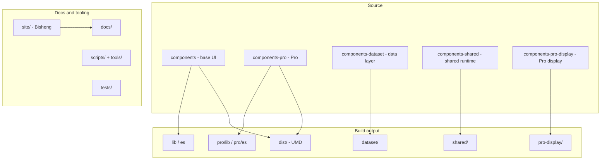
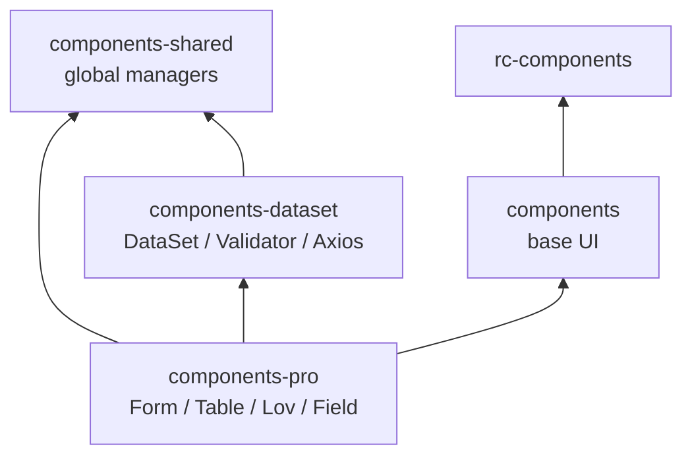

# Choerodon UI Project Structure

This document describes repository layout, module dependencies, build outputs, and common development workflows.

## Overview

- **Package**: `choerodon-ui` (version in [package.json](../../package.json))
- **Type**: Enterprise React UI component library (design language + implementation)
- **Stack**: React 16+, TypeScript 3.7, MobX 4.x, Less, Webpack 4, Gulp 4, Bisheng (documentation site)
- **Repository**: [open-hand/choerodon-ui](https://github.com/open-hand/choerodon-ui)

### Consumption

```jsx
import { DatePicker } from 'choerodon-ui';
import { Table } from 'choerodon-ui/pro';
import DataSet from 'choerodon-ui/dataset';
import { Button, Form, Table } from 'choerodon-ui/pro-display';
```

## Top-level directories



| Directory | Scale (approx.) | Role |
|-----------|-----------------|------|
| [components/](../../components/) | ~75 modules | Base UI (Button, Table, Form, etc.), Ant Design–like |
| [components-pro/](../../components-pro/) | ~85 modules | Pro: DataSet-driven forms/tables, Lov, PerformanceTable, etc. |
| [components-pro-display/](../../components-pro-display/) | 3 modules (phase 1) | Pro display: Button/Form/Table without DataSet |
| [components-dataset/](../../components-dataset/) | ~18 modules | Data layer: DataSet, Record, Field, validation, Axios |
| [components-shared/](../../components-shared/) | ~9 modules | Shared runtime: modal/popup/tooltip/message managers |
| [components/rc-components/](../../components/rc-components/) | ~278 files | Vendored rc-* primitives (table, tree, calendar, …) |
| [site/](../../site/) | Docs site | Bisheng theme, templates, static assets |
| [docs/](../) | Guides | Design specs and React usage (EN/ZH) |
| [scripts/](../../scripts/) + [tools/](../../tools/) | Tooling | Gulp, Less, Jest preprocessors, Webpack |
| [tests/](../../tests/) | Tests | Jest setup |
| [typings/](../../typings/) | Types | Global TS declarations |
| [outer-scripts/](../../outer-scripts/) | Publish | npm publish helpers |

## Module dependency graph



### 1. components — base layer

- **Entry**: [components/index.tsx](../../components/index.tsx) → `lib/index.js`, `es/index.js`
- **Exports**: Affix, Button, DatePicker, Form, Modal, Table, Upload, …
- **Per-component layout** (e.g. `button`):
  - `Button.tsx`, `index.tsx`, `style/`, `demo/*.md`, `index.*.md`, `__tests__/`
- **Globals**: `configure`, `config-provider`, `locale-provider`

### 2. components-pro — enterprise layer

- **Entry**: [components-pro/index.tsx](../../components-pro/index.tsx) → `pro/lib`, `pro/es`
- **Focus**: Back-office data-driven UI with MobX + DataSet
- **Examples**:
  - Data-bound: TextField, NumberField, Select, Lov, Table, Form
  - Advanced tables: PerformanceTable, Screening
  - Business: Attachment, CodeArea, RichText, SecretField, Board
  - Hooks: `useDataSet`, `useModal`, `useComputed`
- **Dataset**: Many modules re-export from `choerodon-ui/dataset` (e.g. [DataSet.tsx](../../components-pro/data-set/DataSet.tsx))

### 3. components-dataset — data layer

- **Entry**: [components-dataset/index.ts](../../components-dataset/index.ts) → `dataset/`
- **Core**: DataSet / Record / Field (MobX), Validator, enhanced Axios, stores (Lov, Lookup, Attachment)
- **Utilities**: math, TreeHelper, PromiseQueue, Uploader
- **Note**: `data-set/DataSet.tsx` is the largest core module (~3700+ lines)

### 4. components-shared — shared runtime

- **Entry**: [components-shared/index.ts](../../components-shared/index.ts) → `shared/`
- **Managers**: Modal, Popup, Tooltip, Message, Notification, Context, `global`

### 5. components-pro-display — display layer

- **Entry**: [components-pro-display/index.tsx](../../components-pro-display/index.tsx) → `pro-display/lib`, `pro-display/es`
- **Focus**: Progressive DataSet-free Pro UI; phase 1: Button, Form, Table
- **Import**: `choerodon-ui/pro-display`

### 6. rc-components — primitives

- Path: `components/rc-components/`
- Built via `compileRc` into `lib/rc-components` and `es/rc-components`
- Wrapped by higher-level Table, Tree, Calendar, Upload, etc.

## Build and publish

### Gulp ([gulpfile.js](../../gulpfile.js))

`npm run compile` runs eight parallel tasks:

| Task | Input | Output |
|------|-------|--------|
| compile-with-lib | components/** | lib/ (CJS) |
| compile-with-es | components/** | es/ (ESM) |
| compile-with-pro-lib | components-pro/** | pro/lib/ |
| compile-with-pro-es | components-pro/** | pro/es/ |
| compile-with-dataset | components-dataset/** | dataset/ |
| compile-with-shared | components-shared/** | shared/ |
| compile-with-rc-* | rc-components/** | lib/es/rc-components/ |
| compile-with-pro-display-* | components-pro-display/** | pro-display/lib, es |

Pipeline: TypeScript → Babel → Less → CSS → cssInjection → path rewrites.

`npm run dist` produces UMD bundles: `dist/choerodon-ui.min.js`, `dist/choerodon-ui-pro.min.js`, and **`dist/choerodon-ui-pro-display.min.js`** (display components for plain HTML; build alone with `npm run dist:pro-display`).

### npm entry points

```json
"main": "lib/index.js",
"module": "es/index.js",
"main-pro": "pro/lib/index.js",
"module-pro": "pro/es/index.js",
"files": ["dist", "lib", "es", "pro", "dataset", "shared", "outer-scripts"]
```

See [package.json](../../package.json).

### TypeScript paths

[tsconfig.json](../../tsconfig.json) maps `choerodon-ui/*` aliases to source trees for development without a prior compile.

## Documentation site

- **Tooling**: Bisheng
- **Config**: [site/bisheng.config.js](../../site/bisheng.config.js), port 8001
- **Sources**: component docs/demos under `components/` and `components-pro/`, plus `docs/`
- **Dev**: `npm start` → http://127.0.0.1:8001
- **Deploy**: `npm run deploy`

## Testing and quality

- Jest 25 + Enzyme ([.jest.js](../../.jest.js), [tests/setup.js](../../tests/setup.js))
- Unit tests (`*.test.js`) and demo snapshots (`demo.test.js`)
- ESLint, Stylelint, demo markdown lint; Husky + lint-staged

## Common scripts

| Script | Purpose |
|--------|---------|
| `npm start` | Local docs (dev) |
| `npm run compile` | Build lib/es/pro/dataset/shared |
| `npm run dist` | UMD bundles |
| `npm test` | Jest |
| `npm run lint` | Full lint |
| `npm run site` | Production docs build |
| `npm run pub` | Test, compile, publish |

## Dependencies and compatibility

- **Peers**: React 16.8+, MobX 4.x, mobx-react, lodash, axios
- **Theming**: Less 3.x + CSS variables / `configure`
- **State**: Pro layer uses MobX decorators and observable DataSet
- **Browsers**: Modern browsers + IE 9+ (`browserslist` in package.json)

## Summary

Choerodon UI uses a **single package, multiple entry points** layout:

1. **Base** (`components`) — general-purpose UI, Ant Design–like
2. **Data** (`components-dataset`) — DataSet-centric business model
3. **Pro** (`components-pro`) — data-bound and advanced business components
4. **Shared** (`components-shared`) — global overlay and messaging coordination
5. **Display** (`components-pro-display`) — Pro look without DataSet (`/pro-display`)

Source lives under five `components-*` trees; builds map to npm root, `/pro`, `/pro-display`, `/dataset`, and `/shared`. Documentation ships in the same repository as the components.
