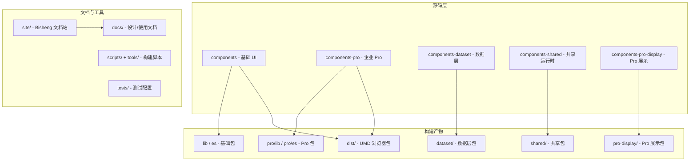
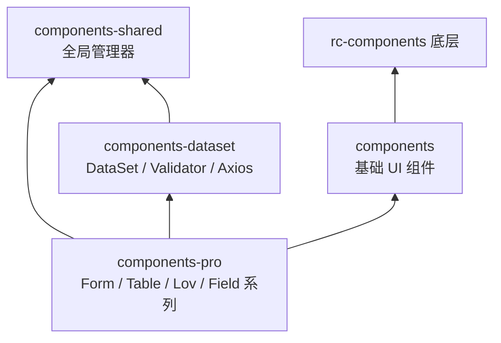

# Choerodon UI 项目结构

本文档说明 Choerodon UI 仓库的目录划分、模块依赖、构建产物与常用开发命令。

## 项目定位

- **包名**: `choerodon-ui`（当前版本见 [package.json](../../package.json)）
- **类型**: 企业级 React UI 组件库（设计语言 + 实现）
- **技术栈**: React 16+、TypeScript 3.7、MobX 4.x、Less、Webpack 4、Gulp 4、Bisheng（文档站）
- **仓库**: [open-hand/choerodon-ui](https://github.com/open-hand/choerodon-ui)

### 使用方式

```jsx
import { DatePicker } from 'choerodon-ui';
import { Table } from 'choerodon-ui/pro';
import DataSet from 'choerodon-ui/dataset';
import { Button, Form, Table } from 'choerodon-ui/pro-display';
```

## 顶层目录



| 目录 | 规模（约） | 职责 |
|------|------------|------|
| [components/](../../components/) | ~75 子模块 | 基础 UI（Button、Table、Form 等），风格接近 Ant Design |
| [components-pro/](../../components-pro/) | ~85 子模块 | 企业 Pro（DataSet 绑定表单/表格、Lov、PerformanceTable 等） |
| [components-pro-display/](../../components-pro-display/) | 3 子模块（首期） | Pro 展示版（Button/Form/Table），无 DataSet |
| [components-dataset/](../../components-dataset/) | ~18 子模块 | 数据层：`DataSet`、`Record`、`Field`、校验、Axios |
| [components-shared/](../../components-shared/) | ~9 子模块 | 共享运行时：Modal/Popup/Tooltip/Message 等管理器 |
| [components/rc-components/](../../components/rc-components/) | ~278 文件 | 内嵌 fork 的 rc-* 底层（table、tree、calendar 等） |
| [site/](../../site/) | 文档站 | Bisheng 主题、模板、静态资源 |
| [docs/](../) | 指南 | 设计规范与 React 使用文档（中英双语） |
| [scripts/](../../scripts/) + [tools/](../../tools/) | 构建工具 | Gulp 辅助、Less、Jest 预处理、Webpack |
| [tests/](../../tests/) | 测试 | Jest setup |
| [typings/](../../typings/) | 类型 | 全局 TS 声明补充 |
| [outer-scripts/](../../outer-scripts/) | 发布 | npm 发布相关脚本 |

## 模块依赖关系



### 1. components — 基础组件层

- **入口**: [components/index.tsx](../../components/index.tsx) → 编译为 `lib/index.js`、`es/index.js`
- **典型导出**: Affix、Button、DatePicker、Form、Modal、Table、Upload 等
- **单组件目录约定**（以 `button` 为例）:
  - `Button.tsx` — 实现
  - `index.tsx` — 导出
  - `style/index.less`、`style/index.tsx` — 样式
  - `demo/*.md` — 文档站演示
  - `index.zh-CN.md`、`index.en-US.md` — API 文档
  - `__tests__/` — 单测与 demo 快照
- **全局能力**: `configure`、`config-provider`、`locale-provider`

### 2. components-pro — 企业 Pro 层

- **入口**: [components-pro/index.tsx](../../components-pro/index.tsx) → `pro/lib`、`pro/es`
- **定位**: 中后台数据驱动 UI，依赖 MobX + DataSet
- **代表组件**:
  - 数据绑定: TextField、NumberField、Select、Lov、Table、Form
  - 高级表格: PerformanceTable、Screening
  - 业务组件: Attachment、CodeArea、RichText、SecretField、Board
  - Hooks: `useDataSet`、`useModal`、`useComputed`
- **与 dataset**: 大量 re-export，例如 [components-pro/data-set/DataSet.tsx](../../components-pro/data-set/DataSet.tsx) 转发 `choerodon-ui/dataset`；校验规则复用 dataset

### 3. components-dataset — 数据层

- **入口**: [components-dataset/index.ts](../../components-dataset/index.ts) → `dataset/`
- **核心**: `DataSet`、`Record`、`Field`（MobX）、`Validator`、`Axios`（cache/throttle）、`stores`（LovCodeStore、LookupCodeStore、AttachmentStore 等）
- **工具**: math、TreeHelper、PromiseQueue、Uploader
- **说明**: `data-set/DataSet.tsx` 单文件约 3700+ 行，为业务数据模型核心

### 4. components-shared — 共享运行时

- **入口**: [components-shared/index.ts](../../components-shared/index.ts) → `shared/`
- **职责**: ModalManager、PopupManager、TooltipManager、MessageManager、NotificationManager、ContextManager、`global`

### 5. components-pro-display — Pro 展示层

- **入口**: [components-pro-display/index.tsx](../../components-pro-display/index.tsx) → `pro-display/lib`、`pro-display/es`
- **定位**: 渐进式剥离 DataSet，首期 Button / Form / Table，复用 Pro 样式
- **消费**: `import { Button } from 'choerodon-ui/pro-display'`

### 6. rc-components — 底层

- 路径: `components/rc-components/`
- 编译任务 `compileRc` → `lib/rc-components`、`es/rc-components`
- 供 Table、Tree、Calendar、Upload 等封装使用

## 构建与发布

### Gulp 编译（[gulpfile.js](../../gulpfile.js)）

`npm run compile` 并行 8 项任务：

| 任务 | 输入 | 输出 |
|------|------|------|
| compile-with-lib | components/** | lib/ (CJS) |
| compile-with-es | components/** | es/ (ESM) |
| compile-with-pro-lib | components-pro/** | pro/lib/ |
| compile-with-pro-es | components-pro/** | pro/es/ |
| compile-with-dataset | components-dataset/** | dataset/ |
| compile-with-shared | components-shared/** | shared/ |
| compile-with-rc-lib/es | rc-components/** | lib/es/rc-components/ |
| compile-with-pro-display-lib/es | components-pro-display/** | pro-display/lib、es |

处理流程: TypeScript 编译 → Babel 转译 → Less 转 CSS → 样式 cssInjection → 路径替换。

`npm run dist` 经 Webpack 产出 UMD：`dist/choerodon-ui.min.js`、`dist/choerodon-ui-pro.min.js`、**`dist/choerodon-ui-pro-display.min.js`**（展示组件，可纯 HTML 使用，`npm run dist:pro-display` 单独构建）。

### npm 包入口

```json
"main": "lib/index.js",
"module": "es/index.js",
"main-pro": "pro/lib/index.js",
"module-pro": "pro/es/index.js",
"files": ["dist", "lib", "es", "pro", "dataset", "shared", "outer-scripts"]
```

详见 [package.json](../../package.json)。

### 开发时 TypeScript 路径

[tsconfig.json](../../tsconfig.json) 将 `choerodon-ui/lib/*`、`choerodon-ui/pro/lib/*`、`choerodon-ui/dataset/*`、`choerodon-ui/shared/*` 映射到对应源码目录，便于未编译时本地调试。

## 文档站

- **工具**: Bisheng
- **配置**: [site/bisheng.config.js](../../site/bisheng.config.js)，默认端口 8001
- **内容**: `components/`、`components-pro/` 组件文档与 demo，`docs/` 设计/使用指南
- **开发**: `npm start` → http://127.0.0.1:8001
- **部署**: `npm run deploy`

## 测试与质量

- Jest 25 + Enzyme，配置 [.jest.js](../../.jest.js)，setup [tests/setup.js](../../tests/setup.js)
- `*.test.js` 单测；`demo.test.js` demo 快照
- ESLint、Stylelint、demo markdown lint；Husky + lint-staged

## 常用命令

| 命令 | 用途 |
|------|------|
| `npm start` | 本地文档站（开发） |
| `npm run compile` | 编译 lib/es/pro/dataset/shared |
| `npm run dist` | UMD 打包 |
| `npm test` | Jest |
| `npm run lint` | 全量 lint |
| `npm run site` | 生产文档站构建 |
| `npm run pub` | 测试 + 编译 + 发布 |

## 依赖与兼容

- **Peer**: React 16.8+、MobX 4.x、mobx-react、lodash、axios
- **样式**: Less 3.x，主题可通过 CSS Variables 与 `configure` 定制
- **状态**: Pro 层深度集成 MobX（装饰器 + observable DataSet）
- **浏览器**: 现代浏览器 + IE 9+（见 package.json `browserslist`）

## 架构小结

Choerodon UI 采用**单包多入口**（monorepo-style）布局：

1. **基础层** (`components`) — 通用 UI，接近 Ant Design
2. **数据层** (`components-dataset`) — DataSet 驱动的业务数据模型
3. **Pro 层** (`components-pro`) — 数据绑定表单/表格/业务组件
4. **共享层** (`components-shared`) — 弹层与消息全局协调
5. **展示层** (`components-pro-display`) — 无 DataSet 的 Pro 外观组件（`pro-display` 入口）

源码在五个 `components-*` 目录，构建后对应 npm 根路径、`/pro`、`/pro-display`、`/dataset`、`/shared`；文档与组件同仓维护。
